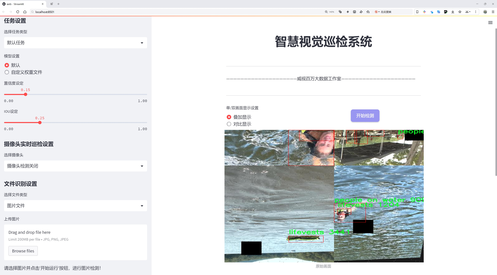
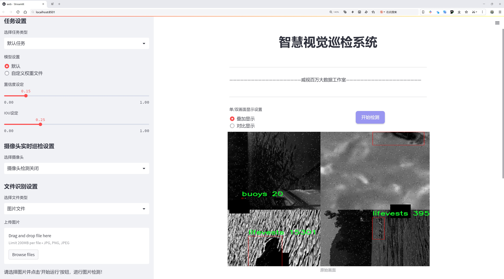
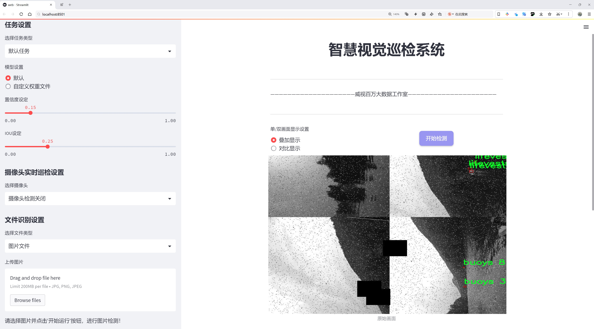
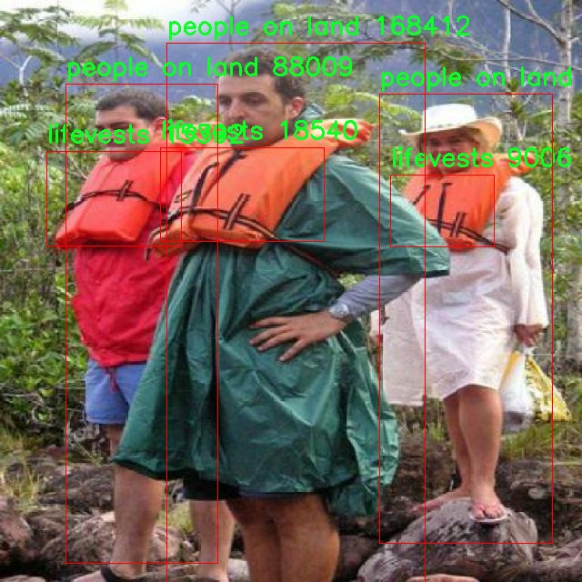
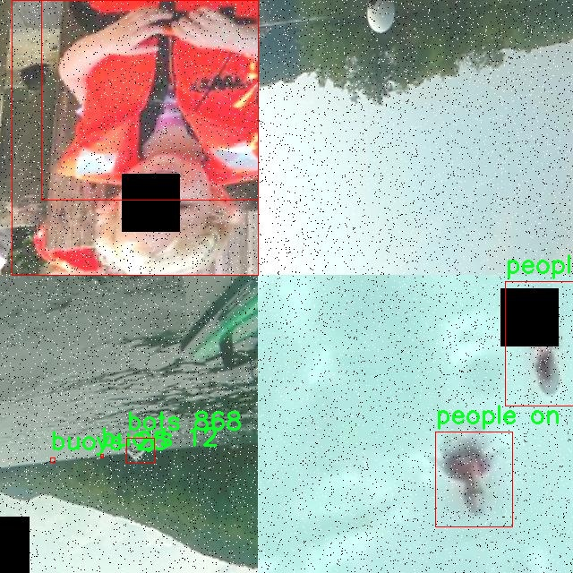
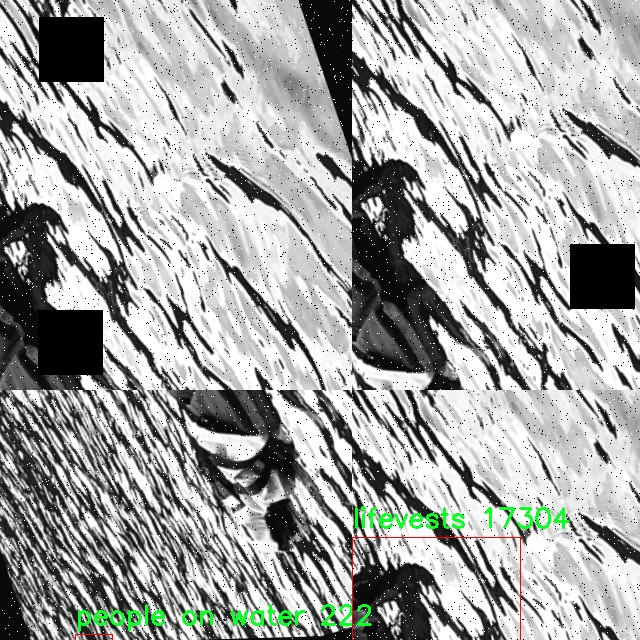
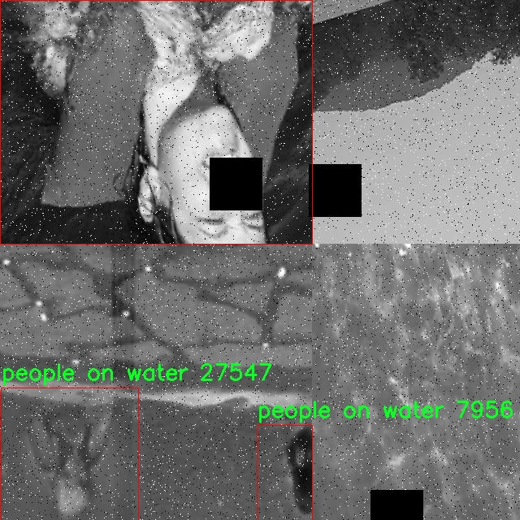
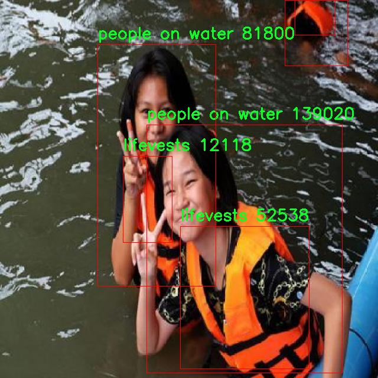

# 人员落水与救援设备人员检测检测系统源码分享
 # [一条龙教学YOLOV8标注好的数据集一键训练_70+全套改进创新点发刊_Web前端展示]

### 1.研究背景与意义

项目参考[AAAI Association for the Advancement of Artificial Intelligence](https://gitee.com/qunshansj/projects)

项目来源[AACV Association for the Advancement of Computer Vision](https://gitee.com/qunmasj/projects)

研究背景与意义

随着城市化进程的加快和水域活动的增加，人员落水事件的发生频率逐年上升，给社会带来了巨大的安全隐患。根据相关统计数据，水域事故不仅造成了人员伤亡，还对家庭和社会造成了深远的影响。因此，如何有效地监测和预警落水事件，成为了亟待解决的社会问题。传统的人工监测方法往往存在反应迟缓、覆盖范围有限等缺陷，难以满足现代社会对安全监控的高要求。为此，基于先进的计算机视觉技术，开发一套高效的人员落水与救援设备人员检测系统显得尤为重要。

在这一背景下，YOLO（You Only Look Once）系列目标检测模型因其高效性和实时性而受到广泛关注。YOLOv8作为该系列的最新版本，具备了更强的特征提取能力和更快的推理速度，能够在复杂环境中快速准确地识别目标。通过对YOLOv8的改进，结合具体的应用场景，可以显著提升对落水人员及救援设备的检测精度和响应速度，从而为救援行动争取宝贵的时间。

本研究所使用的数据集包含3400张图像，涵盖了7个类别，包括船只、救生艇、浮标、救生衣、岸上的人、水中的人等。这些类别的多样性为模型的训练提供了丰富的样本，有助于提高模型在不同场景下的适应能力。尤其是在水域环境中，落水人员的检测往往受到水面波动、光照变化等因素的影响，因此，构建一个包含多种场景和条件的数据集，能够有效提升模型的鲁棒性和准确性。

此外，随着深度学习技术的不断发展，模型的可解释性和可用性也逐渐成为研究的重点。通过对YOLOv8模型的改进，研究者可以探索不同的特征提取方法和数据增强技术，以进一步提高检测效果。同时，研究还可以结合实时视频流处理技术，实现对落水事件的实时监测和报警。这不仅能够提高救援效率，还能为后续的事故分析和预防提供数据支持。

本研究的意义不仅在于技术层面的创新，更在于其对社会安全的积极影响。通过构建基于改进YOLOv8的人员落水与救援设备人员检测系统，可以为水域安全管理提供有力的技术支持，降低落水事件的发生率，保护人民的生命财产安全。此外，该系统的成功应用还可以为其他领域的目标检测提供借鉴，推动计算机视觉技术在更多实际场景中的应用。

综上所述，基于改进YOLOv8的人员落水与救援设备人员检测系统的研究，不仅具有重要的理论价值，也具有广泛的实际应用前景。通过对该系统的深入研究和开发，能够为提升水域安全监测水平、保障人民生命安全做出积极贡献。

### 2.图片演示







##### 注意：由于此博客编辑较早，上面“2.图片演示”和“3.视频演示”展示的系统图片或者视频可能为老版本，新版本在老版本的基础上升级如下：（实际效果以升级的新版本为准）

  （1）适配了YOLOV8的“目标检测”模型和“实例分割”模型，通过加载相应的权重（.pt）文件即可自适应加载模型。

  （2）支持“图片识别”、“视频识别”、“摄像头实时识别”三种识别模式。

  （3）支持“图片识别”、“视频识别”、“摄像头实时识别”三种识别结果保存导出，解决手动导出（容易卡顿出现爆内存）存在的问题，识别完自动保存结果并导出到tempDir中。

  （4）支持Web前端系统中的标题、背景图等自定义修改，后面提供修改教程。

  另外本项目提供训练的数据集和训练教程,暂不提供权重文件（best.pt）,需要您按照教程进行训练后实现图片演示和Web前端界面演示的效果。

### 3.视频演示

[3.1 视频演示](https://www.bilibili.com/video/BV1hv4hevEUK/)

### 4.数据集信息展示

##### 4.1 本项目数据集详细数据（类别数＆类别名）

nc: 6
names: ['boats', 'bots', 'buoys', 'lifevests', 'people on land', 'people on water']


##### 4.2 本项目数据集信息介绍

数据集信息展示

在现代计算机视觉领域，数据集的构建与应用是推动技术进步的重要基石。本研究所使用的数据集名为“All classes”，专门用于训练和改进YOLOv8模型，以实现对人员落水与救援设备的精准检测。该数据集包含六个类别，分别为“boats”（船只）、“bots”（小型水上无人机）、“buoys”（浮标）、“lifevests”（救生衣）、“people on land”（陆地上的人）和“people on water”（水面上的人）。这些类别的选择旨在涵盖与水上救援场景密切相关的各类对象，以确保模型在实际应用中的高效性和准确性。

首先，数据集中包含的“boats”类别是指各种类型的船只，包括救生艇、游艇和渔船等。这些船只在水上救援行动中扮演着至关重要的角色，能够快速到达落水人员的身边，提供必要的帮助。因此，准确识别船只的存在与位置，对于提升救援效率至关重要。

其次，“bots”类别涵盖了现代水上救援中越来越常见的小型水上无人机。这些无人机能够在水面上快速巡逻，实时监测落水人员的状态，并将信息反馈给救援指挥中心。通过对这一类别的有效检测，救援人员可以及时获取关键数据，从而制定更为精准的救援策略。

接下来，“buoys”类别代表了在水域中常见的浮标。这些浮标不仅可以标示水域的安全区域，还能作为落水人员的求救信号。通过检测浮标的存在，系统能够更好地判断水域的安全性，并为落水人员提供有效的定位信息。

“lifevests”类别则是指救生衣，这一救援设备在水上活动中至关重要。有效检测救生衣的存在，可以帮助系统判断是否有落水人员具备自救能力，从而优化救援方案。

此外，“people on land”与“people on water”两个类别分别代表了在陆地和水面上的人员。这两个类别的检测不仅可以帮助系统识别潜在的落水人员，还能判断救援现场的人员分布情况，为救援行动提供全面的支持。尤其是在复杂的水上环境中，准确区分这两类人员将有助于提升救援的针对性和有效性。

综上所述，数据集“All classes”通过精心设计的六个类别，全面覆盖了与人员落水及救援设备相关的关键对象。这些类别的多样性和针对性，为YOLOv8模型的训练提供了丰富的样本，使其能够在复杂的水上救援场景中实现高效、准确的检测。随着模型性能的不断提升，期望能够在实际应用中显著提高水上救援的成功率，保障落水人员的生命安全。数据集的构建不仅是技术发展的需要，更是对人类生命的关怀与责任。











### 5.全套项目环境部署视频教程（零基础手把手教学）

[5.1 环境部署教程链接（零基础手把手教学）](https://www.ixigua.com/7404473917358506534?logTag=c807d0cbc21c0ef59de5)


[5.2 安装Python虚拟环境创建和依赖库安装视频教程链接（零基础手把手教学）](https://www.ixigua.com/7404474678003106304?logTag=1f1041108cd1f708b01a)

### 6.手把手YOLOV8训练视频教程（零基础小白有手就能学会）

[6.1 手把手YOLOV8训练视频教程（零基础小白有手就能学会）](https://www.ixigua.com/7404477157818401292?logTag=d31a2dfd1983c9668658)

### 7.70+种全套YOLOV8创新点代码加载调参视频教程（一键加载写好的改进模型的配置文件）

[7.1 70+种全套YOLOV8创新点代码加载调参视频教程（一键加载写好的改进模型的配置文件）](https://www.ixigua.com/7404478314661806627?logTag=29066f8288e3f4eea3a4)

### 8.70+种全套YOLOV8创新点原理讲解（非科班也可以轻松写刊发刊，V10版本正在科研待更新）

由于篇幅限制，每个创新点的具体原理讲解就不一一展开，具体见下列网址中的创新点对应子项目的技术原理博客网址【Blog】：


[8.1 70+种全套YOLOV8创新点原理讲解链接](https://gitee.com/qunmasj/good)

### 9.系统功能展示（检测对象为举例，实际内容以本项目数据集为准）

图9.1.系统支持检测结果表格显示

  图9.2.系统支持置信度和IOU阈值手动调节

  图9.3.系统支持自定义加载权重文件best.pt(需要你通过步骤5中训练获得)

  图9.4.系统支持摄像头实时识别

  图9.5.系统支持图片识别

  图9.6.系统支持视频识别

  图9.7.系统支持识别结果文件自动保存

  图9.8.系统支持Excel导出检测结果数据


### 10.原始YOLOV8算法原理

原始YOLOv8算法原理

YOLOv8作为目标检测领域的最新进展，延续了YOLO系列的设计理念，结合了YOLOv5和YOLOv7的优点，采用了一种全新的网络架构，以实现更高的检测精度和速度。其基本结构依然包括输入层、主干网络、特征融合层（Neck）和解耦头（Head），但在每个模块中都进行了创新和优化，以应对现代目标检测任务的复杂性。

在输入层，YOLOv8首先对输入图像进行预处理，将其调整为640x640的RGB格式。这一过程不仅包括简单的缩放，还引入了多种数据增强技术，如马赛克增强、混合增强、空间扰动和颜色扰动等，以增加训练数据的多样性和鲁棒性。这些增强手段旨在提升模型在不同场景下的泛化能力，使其能够更好地适应各种复杂的目标检测任务。

主干网络部分，YOLOv8基于YOLOv5的CSPDarknet结构，采用了C2f模块替代了YOLOv5中的C3模块。C2f模块的设计灵感来源于YOLOv7的ELAN结构，旨在通过引入更多的shortcut连接来缓解深层网络中的梯度消失问题，从而提高特征的重用效率。C2f模块由多个CBS（卷积+归一化+SiLU激活）模块和若干个Bottleneck组成，形成了一个强大的特征提取器。通过对特征图进行分支处理，C2f模块能够有效地捕捉到更多的隐藏特征，并保持输入输出特征图的尺寸一致，确保了特征流的连续性和稳定性。

在特征融合层（Neck），YOLOv8采用了PAN-FPN（Path Aggregation Network with Feature Pyramid Network）结构，以实现多尺度特征的有效融合。该结构通过自下而上的方式将高层特征与中层和浅层特征进行融合，增强了模型对不同尺度目标的检测能力。具体而言，YOLOv8在上采样阶段去除了YOLOv5中的1x1卷积操作，直接将高层特征进行上采样后与中层特征进行拼接，进而通过C2f模块进行进一步处理。这种设计使得模型能够更好地结合细节信息与语义信息，从而提升目标检测的准确性。

解耦头（Head）部分是YOLOv8的另一个创新之处。与传统的anchor-based方法不同，YOLOv8采用了anchor-free的检测策略，利用解耦的分类和回归分支来提高检测效率。具体来说，Head部分通过三个不同尺度的特征图进行目标分类和边框回归，输出的特征图经过Softmax和卷积操作，最终转换为真实的边框格式。这种解耦设计不仅提高了模型的灵活性，还使得目标检测的过程更加高效。

在损失函数的设计上，YOLOv8引入了VFLLoss作为分类损失，DFLLoss和CIoULoss作为回归损失，以应对目标检测中常见的样本不平衡问题。通过这种多损失函数的组合，YOLOv8能够更好地处理正负样本的比例失衡，提升模型的学习效果和检测精度。此外，YOLOv8采用了Task-Aligned的样本匹配策略，使得分类分数和回归分数能够更好地进行加权匹配，从而进一步提高了检测的准确性。

综上所述，YOLOv8通过对网络结构的创新和损失函数的优化，成功地提升了目标检测的性能。其主干网络的C2f模块、特征融合层的PAN-FPN结构以及解耦头的设计，使得YOLOv8在复杂的目标检测任务中展现出了更高的精度和速度。尽管在一些特定场景下仍存在挑战，如小目标的检测和复杂背景下的定位误差，但YOLOv8的设计理念和技术创新为未来的目标检测研究提供了新的思路和方向。随着YOLOv8的推广和应用，目标检测技术将迎来新的发展机遇，为各类实际应用场景提供更为强大的支持。


### 11.项目核心源码讲解（再也不用担心看不懂代码逻辑）

#### 11.1 70+种YOLOv8算法改进源码大全和调试加载训练教程（非必要）\ultralytics\nn\extra_modules\attention.py

以下是经过简化和注释的核心代码部分，保留了主要的功能和结构，同时添加了详细的中文注释。

```python
import torch
from torch import nn
import torch.nn.functional as F

class EMA(nn.Module):
    """
    Exponential Moving Average (EMA) 模块
    用于对输入特征进行加权平均，增强特征表达能力。
    """
    def __init__(self, channels, factor=8):
        super(EMA, self).__init__()
        self.groups = factor
        assert channels // self.groups > 0
        self.softmax = nn.Softmax(-1)
        self.agp = nn.AdaptiveAvgPool2d((1, 1))
        self.pool_h = nn.AdaptiveAvgPool2d((None, 1))
        self.pool_w = nn.AdaptiveAvgPool2d((1, None))
        self.gn = nn.GroupNorm(channels // self.groups, channels // self.groups)
        self.conv1x1 = nn.Conv2d(channels // self.groups, channels // self.groups, kernel_size=1)
        self.conv3x3 = nn.Conv2d(channels // self.groups, channels // self.groups, kernel_size=3, padding=1)

    def forward(self, x):
        b, c, h, w = x.size()
        group_x = x.reshape(b * self.groups, -1, h, w)  # 重新排列为分组形式
        x_h = self.pool_h(group_x)  # 在高度方向进行池化
        x_w = self.pool_w(group_x).permute(0, 1, 3, 2)  # 在宽度方向进行池化并转置
        hw = self.conv1x1(torch.cat([x_h, x_w], dim=2))  # 1x1卷积
        x_h, x_w = torch.split(hw, [h, w], dim=2)  # 分割为高度和宽度的特征
        x1 = self.gn(group_x * x_h.sigmoid() * x_w.permute(0, 1, 3, 2).sigmoid())  # 进行归一化和激活
        x2 = self.conv3x3(group_x)  # 3x3卷积
        x11 = self.softmax(self.agp(x1).reshape(b * self.groups, -1, 1).permute(0, 2, 1))  # 计算权重
        x12 = x2.reshape(b * self.groups, c // self.groups, -1)  # 重新排列
        x21 = self.softmax(self.agp(x2).reshape(b * self.groups, -1, 1).permute(0, 2, 1))  # 计算权重
        x22 = x1.reshape(b * self.groups, c // self.groups, -1)  # 重新排列
        weights = (torch.matmul(x11, x12) + torch.matmul(x21, x22)).reshape(b * self.groups, 1, h, w)  # 计算最终权重
        return (group_x * weights.sigmoid()).reshape(b, c, h, w)  # 返回加权后的特征

class SimAM(nn.Module):
    """
    SimAM 模块
    通过自适应加权来增强特征表示。
    """
    def __init__(self, e_lambda=1e-4):
        super(SimAM, self).__init__()
        self.activaton = nn.Sigmoid()  # 激活函数
        self.e_lambda = e_lambda  # 正则化参数

    def forward(self, x):
        b, c, h, w = x.size()
        n = w * h - 1  # 计算总的像素数减去1
        x_minus_mu_square = (x - x.mean(dim=[2, 3], keepdim=True)).pow(2)  # 计算每个像素与均值的平方差
        y = x_minus_mu_square / (4 * (x_minus_mu_square.sum(dim=[2, 3], keepdim=True) / n + self.e_lambda)) + 0.5  # 计算加权
        return x * self.activaton(y)  # 返回加权后的特征

class BiLevelRoutingAttention(nn.Module):
    """
    Bi-Level Routing Attention 模块
    通过双层路由机制进行注意力计算。
    """
    def __init__(self, dim, num_heads=8, n_win=7, topk=4):
        super().__init__()
        self.dim = dim
        self.n_win = n_win  # 窗口数量
        self.num_heads = num_heads  # 注意力头数量
        self.qk_dim = dim // num_heads  # 每个头的维度
        self.router = TopkRouting(qk_dim=self.qk_dim, topk=topk)  # 路由模块

    def forward(self, x):
        # x: 输入特征
        b, c, h, w = x.size()
        # 进行窗口划分和注意力计算
        # 省略具体实现细节
        return x  # 返回经过注意力计算后的特征

# 其他模块省略，类似处理
```

在这个简化版本中，保留了主要的类和方法，去掉了不必要的细节，注释解释了每个模块的功能和关键步骤。你可以根据需要继续添加或修改其他模块的实现。

这个文件包含了多种注意力机制的实现，主要用于深度学习中的图像处理任务，尤其是在YOLOv8等目标检测模型中。以下是对文件中各个部分的逐步分析和解释。

首先，文件导入了一些必要的库，包括PyTorch、Torchvision和一些用于高效计算的模块。这些库提供了构建神经网络所需的基本功能和工具。

接下来，文件定义了一系列的注意力模块，每个模块都有其特定的功能和实现方式。注意力机制是深度学习中一种重要的技术，它允许模型在处理输入数据时动态地关注不同的部分，从而提高模型的性能。

1. **EMA（Exponential Moving Average）**：这个模块实现了一种基于指数移动平均的注意力机制。它通过对输入特征进行分组处理，计算每个组的平均值，并通过sigmoid函数生成权重，从而调整输入特征的表示。

2. **SimAM（Similarity Attention Module）**：该模块通过计算输入特征的均值和方差，生成一个相似度注意力图。它的设计目标是增强特征的表达能力。

3. **SpatialGroupEnhance**：这个模块通过对输入特征进行空间分组增强，利用平均池化和可学习的权重来增强特征的空间信息。

4. **TopkRouting**：实现了一种可微分的Top-k路由机制，允许模型在特征选择时关注最重要的特征。

5. **KVGather**：该模块用于根据路由索引选择特征图中的关键特征，结合权重进行加权求和。

6. **QKVLinear**：实现了Q、K、V（查询、键、值）线性变换的模块，通常用于自注意力机制中。

7. **BiLevelRoutingAttention**：这是一个复杂的双层路由注意力机制，结合了局部和全局的注意力计算。它通过对输入特征进行分块处理，计算每个块的注意力，并通过路由机制选择最重要的特征。

8. **其他注意力模块**：文件中还定义了多种其他的注意力机制，如CoordAtt、BAMBlock、EfficientAttention等。这些模块各自实现了不同的注意力机制，旨在提升模型在图像处理任务中的表现。

9. **DeformConv**：实现了可变形卷积，允许卷积核在输入特征图上进行动态变形，从而更好地捕捉图像中的形状和结构信息。

10. **FocusedLinearAttention**：这是一个基于线性注意力的模块，结合了图像块的处理和注意力机制，旨在提高计算效率和模型性能。

文件的最后部分包含了一些辅助函数，如`img2windows`和`windows2img`，用于在图像和窗口之间进行转换，方便在注意力计算中处理图像块。

总体而言，这个文件实现了多种先进的注意力机制，旨在提升YOLOv8等目标检测模型的性能。这些模块通过不同的方式增强了特征的表达能力，使得模型能够更好地关注重要的图像区域，从而提高检测精度。

#### 11.2 70+种YOLOv8算法改进源码大全和调试加载训练教程（非必要）\ultralytics\nn\extra_modules\ops_dcnv3\modules\__init__.py

以下是保留的核心代码部分，并附上详细的中文注释：

```python
# 导入DCNv3及其相关模块
from .dcnv3 import DCNv3, DCNv3_pytorch, DCNv3_DyHead

# 这行代码从当前包（.）的dcnv3模块中导入了三个类或函数：
# 1. DCNv3：可能是一个深度可分离卷积网络的实现。
# 2. DCNv3_pytorch：可能是基于PyTorch框架的DCNv3实现。
# 3. DCNv3_DyHead：可能是一个动态头部模块，用于处理特定任务（如目标检测等）。
```

以上代码的核心在于导入深度学习模型和模块，以便在后续的代码中使用这些功能。

这个程序文件是一个Python模块的初始化文件，位于`ultralytics\nn\extra_modules\ops_dcnv3\modules`目录下。文件的开头包含了一些版权信息，表明该代码属于OpenGVLab，并且使用MIT许可证，这意味着用户可以自由使用、修改和分发该代码，只要遵循许可证的条款。

文件的主要功能是导入其他模块中的类或函数。在这里，它从同一目录下的`dcnv3`模块中导入了三个对象：`DCNv3`、`DCNv3_pytorch`和`DCNv3_DyHead`。这些对象可能是与深度可分离卷积（DCN）相关的实现，DCN是一种在计算机视觉任务中常用的卷积神经网络改进技术，能够提高模型的表现力和灵活性。

通过这个初始化文件，用户在导入`ops_dcnv3.modules`模块时，可以直接使用`DCNv3`、`DCNv3_pytorch`和`DCNv3_DyHead`这三个对象，而无需单独导入`dcnv3`模块。这种设计使得模块的使用更加方便和高效，符合Python模块化编程的原则。

#### 11.3 ui.py

```python
import sys
import subprocess

def run_script(script_path):
    """
    使用当前 Python 环境运行指定的脚本。

    Args:
        script_path (str): 要运行的脚本路径

    Returns:
        None
    """
    # 获取当前 Python 解释器的路径
    python_path = sys.executable

    # 构建运行命令，使用 streamlit 运行指定的脚本
    command = f'"{python_path}" -m streamlit run "{script_path}"'

    # 执行命令
    result = subprocess.run(command, shell=True)
    # 检查命令执行结果，如果返回码不为0，则表示出错
    if result.returncode != 0:
        print("脚本运行出错。")


# 实例化并运行应用
if __name__ == "__main__":
    # 指定要运行的脚本路径
    script_path = "web.py"  # 假设脚本在当前目录下

    # 调用函数运行脚本
    run_script(script_path)
```

### 代码注释说明：

1. **导入模块**：
   - `sys`：用于获取当前 Python 解释器的路径。
   - `subprocess`：用于执行外部命令。

2. **定义 `run_script` 函数**：
   - 该函数接收一个参数 `script_path`，表示要运行的 Python 脚本的路径。
   - 函数内部首先获取当前 Python 解释器的路径，以便在正确的环境中运行脚本。
   - 然后构建一个命令字符串，使用 `streamlit` 模块来运行指定的脚本。
   - 使用 `subprocess.run` 方法执行构建的命令，并检查返回值以判断脚本是否成功运行。

3. **主程序块**：
   - 当脚本作为主程序运行时，指定要运行的脚本路径（这里假设为 `web.py`）。
   - 调用 `run_script` 函数，传入脚本路径以执行该脚本。

这个程序文件的主要功能是通过当前的 Python 环境来运行一个指定的脚本，具体来说是一个名为 `web.py` 的脚本。程序首先导入了必要的模块，包括 `sys`、`os` 和 `subprocess`，这些模块分别用于获取系统信息、操作系统功能和执行外部命令。

在文件中定义了一个名为 `run_script` 的函数，该函数接受一个参数 `script_path`，表示要运行的脚本的路径。函数内部首先获取当前 Python 解释器的路径，接着构建一个命令字符串，这个命令用于通过 `streamlit` 模块来运行指定的脚本。`streamlit` 是一个用于构建数据应用的库，命令的格式是 `python -m streamlit run script_path`。

然后，使用 `subprocess.run` 方法来执行这个命令。`shell=True` 参数表示在一个新的 shell 中执行命令。执行后，程序会检查命令的返回码，如果返回码不为 0，表示脚本运行过程中出现了错误，程序会打印出“脚本运行出错”的提示信息。

在文件的最后部分，使用 `if __name__ == "__main__":` 语句来确保当这个文件作为主程序运行时，才会执行以下代码。这里指定了要运行的脚本路径为 `web.py`，并调用 `run_script` 函数来执行这个脚本。

整体来看，这个程序文件的设计旨在提供一个简单的接口，通过它可以方便地运行一个特定的 Python 脚本，并且能够处理运行过程中可能出现的错误。

#### 11.4 code\ultralytics\hub\auth.py

以下是代码中最核心的部分，并附上详细的中文注释：

```python
import requests

class Auth:
    """
    处理身份验证过程，包括API密钥处理、基于cookie的身份验证和头部生成。

    支持不同的身份验证方法：
    1. 直接使用API密钥。
    2. 使用浏览器cookie进行身份验证（特别是在Google Colab中）。
    3. 提示用户输入API密钥。
    """

    id_token = api_key = model_key = False  # 初始化身份验证相关的属性

    def __init__(self, api_key="", verbose=False):
        """
        初始化Auth类，可以选择性地传入API密钥。

        参数:
            api_key (str, optional): API密钥或组合的API密钥和模型ID
        """
        # 如果传入的API密钥包含模型ID，则只保留API密钥部分
        api_key = api_key.split("_")[0]

        # 设置API密钥属性，如果没有传入则使用设置中的API密钥
        self.api_key = api_key or SETTINGS.get("api_key", "")

        # 如果提供了API密钥
        if self.api_key:
            # 检查提供的API密钥是否与设置中的API密钥匹配
            if self.api_key == SETTINGS.get("api_key"):
                # 如果匹配，记录用户已登录
                if verbose:
                    LOGGER.info(f"{PREFIX}Authenticated ✅")
                return
            else:
                # 尝试使用提供的API密钥进行身份验证
                success = self.authenticate()
        # 如果没有提供API密钥并且环境是Google Colab
        elif is_colab():
            # 尝试使用浏览器cookie进行身份验证
            success = self.auth_with_cookies()
        else:
            # 请求用户输入API密钥
            success = self.request_api_key()

        # 如果身份验证成功，更新设置中的API密钥
        if success:
            SETTINGS.update({"api_key": self.api_key})
            if verbose:
                LOGGER.info(f"{PREFIX}New authentication successful ✅")
        elif verbose:
            LOGGER.info(f"{PREFIX}Retrieve API key from {API_KEY_URL}")

    def authenticate(self) -> bool:
        """
        尝试使用id_token或API密钥进行身份验证。

        返回:
            bool: 如果身份验证成功则返回True，否则返回False。
        """
        try:
            header = self.get_auth_header()  # 获取身份验证头部
            if header:
                r = requests.post(f"{HUB_API_ROOT}/v1/auth", headers=header)  # 发送身份验证请求
                if not r.json().get("success", False):
                    raise ConnectionError("Unable to authenticate.")
                return True
            raise ConnectionError("User has not authenticated locally.")
        except ConnectionError:
            self.id_token = self.api_key = False  # 重置无效的身份验证信息
            LOGGER.warning(f"{PREFIX}Invalid API key ⚠️")
            return False

    def auth_with_cookies(self) -> bool:
        """
        尝试通过cookie获取身份验证并设置id_token。用户必须在支持的浏览器中登录HUB。

        返回:
            bool: 如果身份验证成功则返回True，否则返回False。
        """
        if not is_colab():
            return False  # 目前仅支持Colab
        try:
            authn = request_with_credentials(f"{HUB_API_ROOT}/v1/auth/auto")  # 请求自动身份验证
            if authn.get("success", False):
                self.id_token = authn.get("data", {}).get("idToken", None)  # 获取id_token
                self.authenticate()  # 使用id_token进行身份验证
                return True
            raise ConnectionError("Unable to fetch browser authentication details.")
        except ConnectionError:
            self.id_token = False  # 重置无效的id_token
            return False

    def get_auth_header(self):
        """
        获取用于API请求的身份验证头部。

        返回:
            (dict): 如果设置了id_token或API密钥，则返回身份验证头部，否则返回None。
        """
        if self.id_token:
            return {"authorization": f"Bearer {self.id_token}"}  # 使用id_token生成头部
        elif self.api_key:
            return {"x-api-key": self.api_key}  # 使用API密钥生成头部
        return None  # 如果都没有，则返回None
```

### 代码核心部分说明：
1. **Auth类**：负责处理身份验证，包括API密钥和cookie的管理。
2. **__init__方法**：初始化Auth对象，处理API密钥的输入和身份验证。
3. **authenticate方法**：尝试使用API密钥或id_token进行身份验证。
4. **auth_with_cookies方法**：在Google Colab环境中，通过cookie进行身份验证。
5. **get_auth_header方法**：生成用于API请求的身份验证头部。

这个程序文件是一个用于管理身份验证的类，名为 `Auth`，主要用于处理与 Ultralytics YOLO 相关的 API 认证。它支持多种认证方式，包括直接使用 API 密钥、通过浏览器 cookies 进行认证（特别是在 Google Colab 环境中），以及提示用户输入 API 密钥。

在类的属性中，`id_token`、`api_key` 和 `model_key` 都被初始化为 `False`，这表示在初始化时没有有效的身份验证信息。构造函数 `__init__` 接受一个可选的 API 密钥参数，如果提供了 API 密钥，则会尝试进行认证。如果没有提供 API 密钥且当前环境是 Google Colab，则会尝试通过 cookies 进行认证；如果都不满足，则会请求用户输入 API 密钥。

`request_api_key` 方法用于提示用户输入 API 密钥，最多允许三次尝试。如果用户输入的密钥有效，则返回成功；否则抛出连接错误。`authenticate` 方法尝试使用提供的 API 密钥或 ID 令牌与服务器进行认证，返回认证是否成功的布尔值。如果认证失败，会重置相关属性并记录警告信息。

`auth_with_cookies` 方法专门用于在 Google Colab 环境中通过 cookies 进行认证。它尝试获取浏览器的认证信息，并调用 `authenticate` 方法进行验证。如果成功，则返回 `True`，否则返回 `False`。

最后，`get_auth_header` 方法用于生成 API 请求所需的认证头。如果存在有效的 ID 令牌或 API 密钥，则返回相应的认证头；如果都不存在，则返回 `None`。

整体而言，这个类的设计目的是为了简化与 Ultralytics YOLO API 的交互，确保用户能够方便地进行身份验证。

#### 11.5 code\ultralytics\data\build.py

以下是代码中最核心的部分，并附上详细的中文注释：

```python
import os
import random
import numpy as np
import torch
from torch.utils.data import dataloader

from .dataset import YOLODataset  # 导入YOLO数据集类
from .utils import PIN_MEMORY  # 导入内存固定的工具

class InfiniteDataLoader(dataloader.DataLoader):
    """
    无限数据加载器，重复使用工作线程。
    继承自标准的DataLoader，使用相同的语法。
    """

    def __init__(self, *args, **kwargs):
        """初始化无限数据加载器，继承自DataLoader。"""
        super().__init__(*args, **kwargs)
        object.__setattr__(self, "batch_sampler", _RepeatSampler(self.batch_sampler))  # 设置批次采样器为重复采样器
        self.iterator = super().__iter__()  # 初始化迭代器

    def __len__(self):
        """返回批次采样器的长度。"""
        return len(self.batch_sampler.sampler)

    def __iter__(self):
        """创建一个无限重复的采样器。"""
        for _ in range(len(self)):
            yield next(self.iterator)  # 不断返回下一个样本

    def reset(self):
        """
        重置迭代器。
        当我们想在训练时修改数据集设置时，这个方法很有用。
        """
        self.iterator = self._get_iterator()  # 重新获取迭代器


class _RepeatSampler:
    """
    永久重复的采样器。
    
    参数:
        sampler (Dataset.sampler): 要重复的采样器。
    """

    def __init__(self, sampler):
        """初始化一个无限重复给定采样器的对象。"""
        self.sampler = sampler

    def __iter__(self):
        """迭代'sampler'并返回其内容。"""
        while True:
            yield from iter(self.sampler)  # 不断返回采样器中的样本


def build_yolo_dataset(cfg, img_path, batch, data, mode="train", rect=False, stride=32):
    """构建YOLO数据集。"""
    return YOLODataset(
        img_path=img_path,  # 图像路径
        imgsz=cfg.imgsz,  # 图像大小
        batch_size=batch,  # 批次大小
        augment=mode == "train",  # 是否进行数据增强
        hyp=cfg,  # 超参数配置
        rect=cfg.rect or rect,  # 是否使用矩形批次
        cache=cfg.cache or None,  # 缓存设置
        single_cls=cfg.single_cls or False,  # 是否单类检测
        stride=int(stride),  # 步幅
        pad=0.0 if mode == "train" else 0.5,  # 填充
        prefix=colorstr(f"{mode}: "),  # 模式前缀
        task=cfg.task,  # 任务类型
        classes=cfg.classes,  # 类别
        data=data,  # 数据配置
        fraction=cfg.fraction if mode == "train" else 1.0,  # 训练时的样本比例
    )


def build_dataloader(dataset, batch, workers, shuffle=True, rank=-1):
    """返回用于训练或验证集的InfiniteDataLoader或DataLoader。"""
    batch = min(batch, len(dataset))  # 确保批次大小不超过数据集大小
    nd = torch.cuda.device_count()  # 获取CUDA设备数量
    nw = min([os.cpu_count() // max(nd, 1), workers])  # 计算工作线程数量
    sampler = None if rank == -1 else distributed.DistributedSampler(dataset, shuffle=shuffle)  # 分布式采样器
    generator = torch.Generator()  # 随机数生成器
    generator.manual_seed(6148914691236517205 + RANK)  # 设置随机种子
    return InfiniteDataLoader(
        dataset=dataset,  # 数据集
        batch_size=batch,  # 批次大小
        shuffle=shuffle and sampler is None,  # 是否打乱数据
        num_workers=nw,  # 工作线程数量
        sampler=sampler,  # 采样器
        pin_memory=PIN_MEMORY,  # 是否固定内存
        collate_fn=getattr(dataset, "collate_fn", None),  # 合并函数
        worker_init_fn=seed_worker,  # 工作线程初始化函数
        generator=generator,  # 随机数生成器
    )


def check_source(source):
    """检查源类型并返回相应的标志值。"""
    webcam, screenshot, from_img, in_memory, tensor = False, False, False, False, False
    if isinstance(source, (str, int, Path)):  # 支持字符串、整数或路径
        source = str(source)
        is_file = Path(source).suffix[1:] in (IMG_FORMATS + VID_FORMATS)  # 检查是否为文件
        is_url = source.lower().startswith(("https://", "http://", "rtsp://", "rtmp://", "tcp://"))  # 检查是否为URL
        webcam = source.isnumeric() or source.endswith(".streams") or (is_url and not is_file)  # 判断是否为摄像头
        screenshot = source.lower() == "screen"  # 判断是否为屏幕截图
        if is_url and is_file:
            source = check_file(source)  # 下载文件
    elif isinstance(source, LOADERS):
        in_memory = True  # 内存中的数据
    elif isinstance(source, (list, tuple)):
        source = autocast_list(source)  # 将列表元素转换为PIL或numpy数组
        from_img = True
    elif isinstance(source, (Image.Image, np.ndarray)):
        from_img = True  # 从图像中加载
    elif isinstance(source, torch.Tensor):
        tensor = True  # 从张量中加载
    else:
        raise TypeError("不支持的图像类型。支持的类型请见文档。")

    return source, webcam, screenshot, from_img, in_memory, tensor  # 返回源及其类型标志


def load_inference_source(source=None, imgsz=640, vid_stride=1, buffer=False):
    """
    加载用于目标检测的推理源并应用必要的转换。

    参数:
        source (str, Path, Tensor, PIL.Image, np.ndarray): 输入源。
        imgsz (int, optional): 推理图像大小，默认为640。
        vid_stride (int, optional): 视频源的帧间隔，默认为1。
        buffer (bool, optional): 是否缓冲流帧，默认为False。

    返回:
        dataset (Dataset): 指定输入源的数据集对象。
    """
    source, webcam, screenshot, from_img, in_memory, tensor = check_source(source)  # 检查源类型
    source_type = source.source_type if in_memory else SourceTypes(webcam, screenshot, from_img, tensor)  # 确定源类型

    # 数据加载器
    if tensor:
        dataset = LoadTensor(source)  # 从张量加载
    elif in_memory:
        dataset = source  # 使用内存中的数据
    elif webcam:
        dataset = LoadStreams(source, imgsz=imgsz, vid_stride=vid_stride, buffer=buffer)  # 从摄像头加载
    elif screenshot:
        dataset = LoadScreenshots(source, imgsz=imgsz)  # 从屏幕截图加载
    elif from_img:
        dataset = LoadPilAndNumpy(source, imgsz=imgsz)  # 从图像加载
    else:
        dataset = LoadImages(source, imgsz=imgsz, vid_stride=vid_stride)  # 从文件加载

    # 将源类型附加到数据集
    setattr(dataset, "source_type", source_type)

    return dataset  # 返回数据集对象
```

### 代码说明
1. **InfiniteDataLoader**: 自定义的数据加载器，支持无限循环采样，适用于需要不断重复数据的场景。
2. **_RepeatSampler**: 一个内部类，用于实现无限重复的采样器。
3. **build_yolo_dataset**: 构建YOLO数据集的函数，设置图像路径、批次大小、数据增强等参数。
4. **build_dataloader**: 创建数据加载器的函数，支持多线程和分布式训练。
5. **check_source**: 检查输入源的类型，返回相应的标志值，以便后续处理。
6. **load_inference_source**: 加载推理源并应用必要的转换，返回数据集对象。

这些部分是YOLO模型训练和推理过程中数据处理的核心逻辑。

这个程序文件主要用于构建和管理YOLO（You Only Look Once）模型的数据加载器，适用于图像和视频的目标检测任务。程序中定义了一些类和函数，以便于在训练和推理过程中有效地加载数据。

首先，程序导入了一些必要的库，包括操作系统、随机数生成、路径处理、NumPy、PyTorch及其相关模块，以及一些Ultralytics库中的数据加载器和工具函数。这些导入为后续的数据处理和模型训练提供了基础。

接下来，定义了一个名为`InfiniteDataLoader`的类，它继承自PyTorch的`DataLoader`。这个类的特点是可以无限循环使用工作线程，适合于需要持续加载数据的场景。它重写了`__len__`和`__iter__`方法，使得数据加载器能够在训练过程中不断地提供数据。此外，`reset`方法允许在训练时重置迭代器，以便在修改数据集设置时使用。

在`InfiniteDataLoader`中，还定义了一个内部类`_RepeatSampler`，这个类的作用是创建一个可以无限重复的采样器。它的`__iter__`方法会不断地迭代给定的采样器，从而实现数据的持续加载。

接着，程序定义了一个`seed_worker`函数，用于设置数据加载器工作线程的随机种子。这是为了确保在多线程环境中数据的随机性和可重复性。

`build_yolo_dataset`函数用于构建YOLO数据集。它接收配置参数、图像路径、批次大小等信息，并返回一个`YOLODataset`对象。这个对象将根据训练模式、增强方式、缓存设置等参数来加载和处理数据。

`build_dataloader`函数则用于返回一个`InfiniteDataLoader`或普通的`DataLoader`，根据传入的数据集、批次大小、工作线程数等参数进行配置。它还考虑了分布式训练的情况，通过`DistributedSampler`来处理数据的分布。

`check_source`函数用于检查输入数据源的类型，并返回相应的标志值。这些标志值用于判断数据源是来自文件、摄像头、内存中的图像，还是其他类型。该函数会处理字符串、路径、图像对象、张量等多种输入形式，并确保输入数据的有效性。

最后，`load_inference_source`函数用于加载推理数据源。它根据输入的源类型（如图像、视频流等）创建相应的数据集对象，并应用必要的转换。这个函数将根据不同的输入类型调用不同的加载器，如`LoadImages`、`LoadStreams`等，以确保能够正确处理各种数据源。

整体而言，这个程序文件为YOLO模型的训练和推理提供了灵活而高效的数据加载解决方案，支持多种数据源和配置选项。

#### 11.6 train.py

以下是经过简化并注释的核心代码部分：

```python
import random
import numpy as np
import torch.nn as nn
from ultralytics.data import build_dataloader, build_yolo_dataset
from ultralytics.engine.trainer import BaseTrainer
from ultralytics.models import yolo
from ultralytics.nn.tasks import DetectionModel
from ultralytics.utils import LOGGER, RANK
from ultralytics.utils.torch_utils import de_parallel, torch_distributed_zero_first

class DetectionTrainer(BaseTrainer):
    """
    基于检测模型的训练类，继承自BaseTrainer类。
    """

    def build_dataset(self, img_path, mode="train", batch=None):
        """
        构建YOLO数据集。

        参数:
            img_path (str): 包含图像的文件夹路径。
            mode (str): 模式，可以是'train'或'val'，用户可以为每种模式自定义不同的增强。
            batch (int, optional): 批次大小，仅用于'rect'模式。默认为None。
        """
        gs = max(int(de_parallel(self.model).stride.max() if self.model else 0), 32)  # 获取模型的最大步幅
        return build_yolo_dataset(self.args, img_path, batch, self.data, mode=mode, rect=mode == "val", stride=gs)

    def get_dataloader(self, dataset_path, batch_size=16, rank=0, mode="train"):
        """构造并返回数据加载器。"""
        assert mode in ["train", "val"]  # 确保模式有效
        with torch_distributed_zero_first(rank):  # 仅在DDP中初始化数据集*.cache一次
            dataset = self.build_dataset(dataset_path, mode, batch_size)  # 构建数据集
        shuffle = mode == "train"  # 训练模式下打乱数据
        workers = self.args.workers if mode == "train" else self.args.workers * 2  # 设置工作线程数
        return build_dataloader(dataset, batch_size, workers, shuffle, rank)  # 返回数据加载器

    def preprocess_batch(self, batch):
        """对图像批次进行预处理，包括缩放和转换为浮点数。"""
        batch["img"] = batch["img"].to(self.device, non_blocking=True).float() / 255  # 转换为浮点数并归一化
        if self.args.multi_scale:  # 如果启用多尺度
            imgs = batch["img"]
            sz = (
                random.randrange(self.args.imgsz * 0.5, self.args.imgsz * 1.5 + self.stride)
                // self.stride
                * self.stride
            )  # 随机选择尺寸
            sf = sz / max(imgs.shape[2:])  # 计算缩放因子
            if sf != 1:
                ns = [
                    math.ceil(x * sf / self.stride) * self.stride for x in imgs.shape[2:]
                ]  # 计算新的形状
                imgs = nn.functional.interpolate(imgs, size=ns, mode="bilinear", align_corners=False)  # 调整图像大小
            batch["img"] = imgs  # 更新批次图像
        return batch

    def get_model(self, cfg=None, weights=None, verbose=True):
        """返回YOLO检测模型。"""
        model = DetectionModel(cfg, nc=self.data["nc"], verbose=verbose and RANK == -1)  # 创建检测模型
        if weights:
            model.load(weights)  # 加载权重
        return model

    def plot_training_samples(self, batch, ni):
        """绘制带有注释的训练样本。"""
        plot_images(
            images=batch["img"],
            batch_idx=batch["batch_idx"],
            cls=batch["cls"].squeeze(-1),
            bboxes=batch["bboxes"],
            paths=batch["im_file"],
            fname=self.save_dir / f"train_batch{ni}.jpg",
            on_plot=self.on_plot,
        )

    def plot_metrics(self):
        """从CSV文件中绘制指标。"""
        plot_results(file=self.csv, on_plot=self.on_plot)  # 保存结果图
```

### 代码注释说明：
1. **类定义**：`DetectionTrainer`类用于处理YOLO模型的训练，继承自`BaseTrainer`。
2. **构建数据集**：`build_dataset`方法根据输入的图像路径和模式构建YOLO数据集。
3. **获取数据加载器**：`get_dataloader`方法创建数据加载器，支持训练和验证模式。
4. **预处理批次**：`preprocess_batch`方法对输入的图像批次进行归一化和尺寸调整。
5. **获取模型**：`get_model`方法用于创建YOLO检测模型并加载权重。
6. **绘制训练样本**：`plot_training_samples`方法用于可视化训练样本及其标注。
7. **绘制指标**：`plot_metrics`方法用于从CSV文件中绘制训练过程中的指标。

这些核心部分和注释帮助理解YOLO模型训练的基本流程和关键步骤。

这个程序文件 `train.py` 是一个用于训练目标检测模型的代码，主要基于 YOLO（You Only Look Once）框架。代码首先导入了一些必要的库和模块，包括数学运算、随机数生成、深度学习相关的库（如 PyTorch）以及 Ultralytics 提供的特定功能模块。

在代码中，定义了一个名为 `DetectionTrainer` 的类，该类继承自 `BaseTrainer`，用于处理与目标检测相关的训练任务。这个类的主要功能包括构建数据集、获取数据加载器、预处理图像批次、设置模型属性、获取模型、验证模型、记录损失、输出训练进度、绘制训练样本和绘制训练指标等。

`build_dataset` 方法用于构建 YOLO 数据集，接受图像路径、模式（训练或验证）和批次大小作为参数。它会根据模型的步幅计算合适的尺寸，并调用 `build_yolo_dataset` 函数来生成数据集。

`get_dataloader` 方法用于构建数据加载器，确保在分布式训练时只初始化一次数据集。它根据模式设置是否打乱数据，并根据训练或验证的需要调整工作线程的数量。

`preprocess_batch` 方法对图像批次进行预处理，包括将图像缩放到合适的大小并转换为浮点数格式。该方法还支持多尺度训练，通过随机选择图像的尺寸来增强模型的鲁棒性。

`set_model_attributes` 方法用于设置模型的属性，包括类别数量和类别名称等，以确保模型能够正确处理数据集中的目标。

`get_model` 方法返回一个 YOLO 检测模型，并在提供权重时加载相应的权重。

`get_validator` 方法返回一个用于验证 YOLO 模型的验证器，记录损失名称并创建验证器实例。

`label_loss_items` 方法返回一个包含训练损失项的字典，方便在训练过程中记录和输出损失信息。

`progress_string` 方法返回一个格式化的字符串，显示训练进度，包括当前的轮次、GPU 内存使用情况、损失值、实例数量和图像大小等信息。

`plot_training_samples` 方法用于绘制训练样本及其标注，生成的图像将保存到指定的目录中。

最后，`plot_metrics` 和 `plot_training_labels` 方法分别用于绘制训练过程中的指标和创建带标签的训练图，以便于可视化和分析模型的训练效果。

总体而言，这个文件提供了一个完整的框架，用于训练 YOLO 目标检测模型，涵盖了数据处理、模型构建、训练过程监控和结果可视化等多个方面。

### 12.系统整体结构（节选）

### 整体功能和构架概括

该程序的整体功能是提供一个完整的框架，用于训练和推理YOLOv8目标检测模型。它包含了数据加载、模型构建、训练过程管理、验证、可视化等多个模块，旨在提升目标检测任务的效率和准确性。通过引入注意力机制、可变形卷积等先进技术，增强了模型的表现力。此外，程序还提供了身份验证和用户界面支持，以便于用户在不同环境下使用。

程序的构架可以分为以下几个主要部分：

1. **数据处理**：负责加载和预处理数据集，包括图像和标签的读取、增强和批处理。
2. **模型构建**：定义和初始化YOLOv8模型，支持多种网络结构和改进技术。
3. **训练管理**：管理训练过程，包括损失计算、优化器设置、训练进度监控等。
4. **验证与评估**：提供验证功能，计算模型在验证集上的性能指标。
5. **可视化**：绘制训练过程中的损失、指标以及样本图像，帮助用户理解模型的训练情况。
6. **用户交互**：提供身份验证和命令行界面，方便用户进行操作。

### 文件功能整理表

| 文件路径                                                                                     | 功能描述                                                       |
|---------------------------------------------------------------------------------------------|---------------------------------------------------------------|
| `70+种YOLOv8算法改进源码大全和调试加载训练教程（非必要）\ultralytics\nn\extra_modules\attention.py` | 实现多种注意力机制，用于增强YOLOv8模型的特征表达能力。       |
| `70+种YOLOv8算法改进源码大全和调试加载训练教程（非必要）\ultralytics\nn\extra_modules\ops_dcnv3\modules\__init__.py` | 初始化DCNv3模块，提供深度可分离卷积的实现。                   |
| `ui.py`                                                                                     | 提供一个接口用于运行指定的Python脚本，主要用于启动Web应用。   |
| `code\ultralytics\hub\auth.py`                                                             | 管理与Ultralytics API的身份验证，支持API密钥和cookies认证。   |
| `code\ultralytics\data\build.py`                                                           | 构建YOLO数据集和数据加载器，支持多种数据源和配置选项。       |
| `train.py`                                                                                  | 处理YOLO模型的训练过程，包括数据加载、模型构建和训练监控。   |
| `code\ultralytics\models\yolo\__init__.py`                                                | 初始化YOLO模型模块，提供模型构建和加载功能。                 |
| `70+种YOLOv8算法改进源码大全和调试加载训练教程（非必要）\ultralytics\utils\callbacks\raytune.py` | 提供与Ray Tune集成的回调函数，用于超参数调优。                 |
| `70+种YOLOv8算法改进源码大全和调试加载训练教程（非必要）\ultralytics\models\yolo\segment\val.py` | 实现YOLOv8模型的分割任务验证功能。                             |
| `code\ultralytics\engine\trainer.py`                                                       | 定义训练器类，管理训练过程中的各项任务和操作。                 |
| `70+种YOLOv8算法改进源码大全和调试加载训练教程（非必要）\ultralytics\utils\tuner.py`       | 提供模型调优功能，支持超参数优化和模型性能提升。               |
| `70+种YOLOv8算法改进源码大全和调试加载训练教程（非必要）\ultralytics\engine\__init__.py`  | 初始化引擎模块，整合训练和推理的相关功能。                     |
| `code\ultralytics\models\yolo\classify\val.py`                                            | 实现YOLOv8模型的分类任务验证功能。                             |

这个表格总结了每个文件的主要功能，帮助用户快速了解整个项目的结构和各个模块的作用。

注意：由于此博客编辑较早，上面“11.项目核心源码讲解（再也不用担心看不懂代码逻辑）”中部分代码可能会优化升级，仅供参考学习，完整“训练源码”、“Web前端界面”和“70+种创新点源码”以“13.完整训练+Web前端界面+70+种创新点源码、数据集获取”的内容为准。

### 13.完整训练+Web前端界面+70+种创新点源码、数据集获取


# [下载链接：https://mbd.pub/o/bread/ZpuTmJdp](https://mbd.pub/o/bread/ZpuTmJdp)